# ДВЕРЬ
## Цель работы
В рамках всем известных событий, возможность оплачивать подписку на зарубежные сервисы будучи на территории РФ сильно ограничена. По этой причине, пользоваться в полной мере такими сервисами, как DNDBeyond, foundryVTT или pathbuilder стало затруднительно. На текущий момент, для организации своих персонажей для D&D или Pathfinder2e есть лишь longsrotyshort (просто лист с заполняемыми полями) и ограниченная версия pathbuilder (без возможности объединять персонажей в кампанию).

Разрабатываемый проект служит замене ушедших зарубежных сервисов: в первую очередь, это интерактивный лист персонажа с гибко настраиваемым отображением информации - с помощью виджетов. Персонажей можно сохранять как локально, так и удалённо, а для ГМ'ов будет возможность управлять собственными кампаниями, напрямую взаимодействуя с листами персонажей игроков-участников.

Одна из основных задумок - дать возможность пользователям ПК самим выбрать какие данные о своём персонаже и когда они хотят видеть/редактировать. Для этого, они смогут создавать несколько "экранов" - наборов виджетов, которые, по сути, являются способом отображения и изменения параметров персонажа (здоровье, характеристики, владения, заклинания, предметы, и т.п.). На каждом экране, пользователь может произвольным образом расположить любые виджеты, и настроить их (например, виджет списка заклинаний можно настроить на отображение лишь их подмножества, например, только заговоров).

### Примеры виджетов
- Счётчик здоровья
- Счётчик параметров (сил, выносливость, и т.д.)
- Класс доспеха
- Список навыков
- Пассивная внимательность
- Бонус инициативы
- Список заклинаний
- Список способностей (в т.ч. черт, пассивок, классовых умений)
- Портрет персонажа
- Произвольный текст (вероятно md)
- Заголовок (имя персонажа, имя игрока, мировоззрение, уровень, опыт, и прочее идущее сверху листа персонажа)
- Список предметов
- Список атак (оружием, кулаками)
- Вдохновение
- Скорость
- Спасброски
- Кости хитов
- Счётчик денег
- Произвольный параметр (просто что-то отдельное человек решил добавить, какое-то числовое поле, редко изменяющееся)
- Произвольный счётчик (на случай наличия какого-то ресурса, который у персонажа не привязан ни к какой из способностей, или который очень хочется вынести отдельно)
- Список активных статусов
- Характеристики заклинаний

## Функциональные требования
- создавать, редактировать, сохранять удалённо и/или локально интерактивные листы персонажей;
- создавать, редактировать, сохранять удалённо и/или локально кампании;
- обеспечить ГМу возможность управлять листами персонажей, учавствующих в его кампаниях;

## Use-case
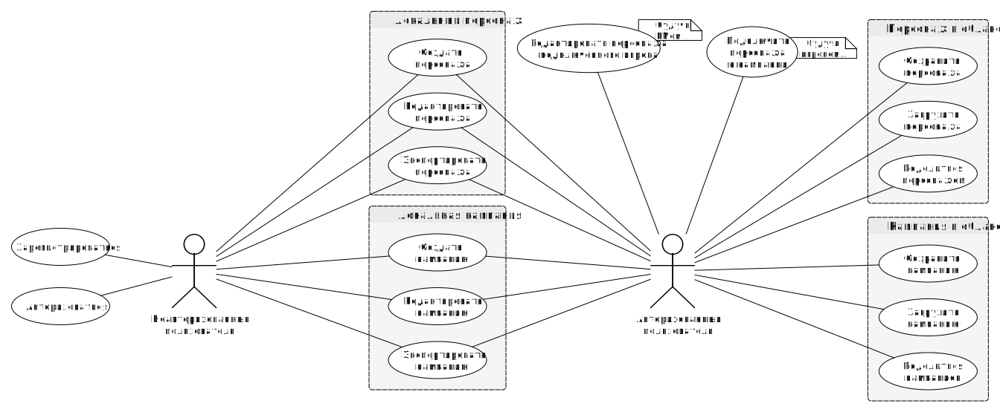

## Основные пользовательские сценарии
- Игрок, уже имеющий существующего персонажа в бумажном виде, желает перенести его в электронный. Он заходит на наш сайт, нажимает кнопку "я игрок", перед ним возникает экран с базовым набором виджетов. Игрок добавляет виджет со списком заклинаний на основной экран, некоторые заметки, редактирует значение здоровья, уровня, владения, и прочих параметров персонажа. Не желая регистрироваться/авторизовываться, игрок сохраняет своего персонажа в формате JSON. В начале следующей игры, игрок открывает тот же сайт на другом устройстве, нажимает кнопку "я игрок", нажимает кнопку "персонажи", нажимает кнопку "+", указывает путь в ФС к JSON файлу со своим персонажем, после чего перед ним открывается экран с листом персонажа - тем, что он экспортировал с другого устройства. Расположение виджетов сохранилось то, что игрок сделал на другом устройстве, и все данные о персонажи тоже перенеслись.
- Небольшая группа друзей желает начать новую кампанию D&D. Каждый из них заходит на сайт, нажимает кнопку "Регистрация", вводят свои данные, после чего каждый из них автоматически становится авторизованным пользователем. Все они переносятся обратно на главный экран. Один из группы друзей (самый главный и толстый) нажимает кнопку "Я ГМ!", все остальные (маленькие и тощие) нажимают кнопку "Я игрок!". Тощие, вооружившись книгой игрока, начинают создавать персонажа, заполняя основные данные, перетягивая для этого на экран различные виджеты и взаимодействуя с ними. Толстый же создаёт нескольно различных "Экранов" для каждой из сюжетных арок, через которые персонажи пройдут на предстоящей сессии. Нажав кнопку "добавить игроков", ГМ вводит пароль кампании и копирует uuid. И то и другое, толстый отправляет игрокам посредством какого-либо популярного мессенджера (такого как ICQ, mail.ru агент или собственного IRC канала). Игроки, нажав кнопку "Подключиться к ГМу" вводят uuid и пароль, подключаются к кампании толстого. Теперь ГМ может вести игру, имея полный доступ к персонажам своих игроков, а все данные будут сохраняться в облаке автоматически.
- ГМ желает помочь неопытному игроку создать персонажа. Для этого, он и игрок авторизовываются, ГМ создаёт кампанию, игрок персонажа, которого подключает к кампании ГМа (подробнее - см. сценарий выше), после чего ГМ и игрок могут в режиме реального времени взаимодейстовать с одним и тем же листом. При этом, набор/расположение виджетов у них разное, при одинаковых данных о персонаже.
- Авторизованный игрок (в идеале, разработчик) обнаружил неполадку со своим персонажем - необычное поведение виджета. Он экспортирует своего персонажа в JSON, обнаруживает противоречивость данных самого персонажа, вручную её исправляет, и импортирует персонажа обратно заместо старого.

## ER диаграмма
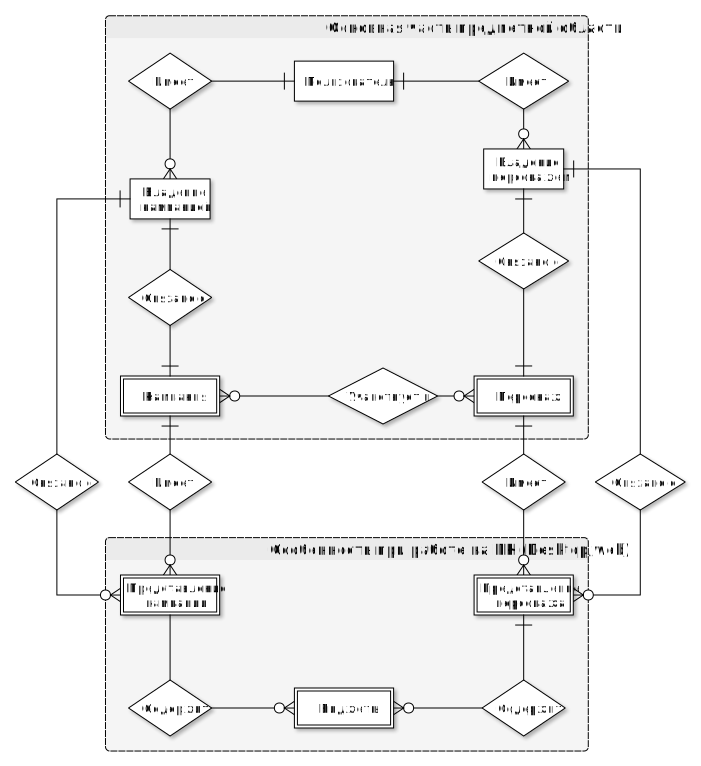

## Компонентная диаграмма системы
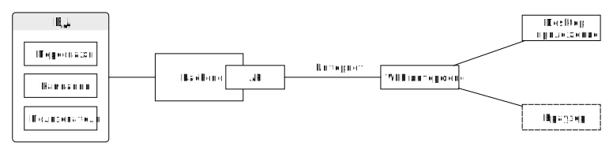

## Экраны будущего web-приложения
### Главное меню
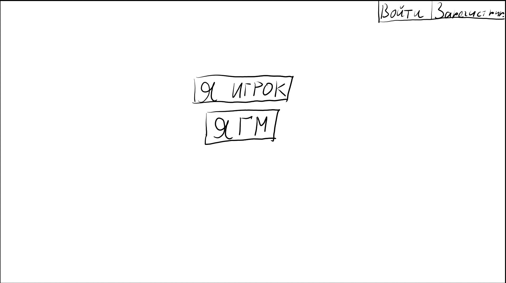
### Авторизация
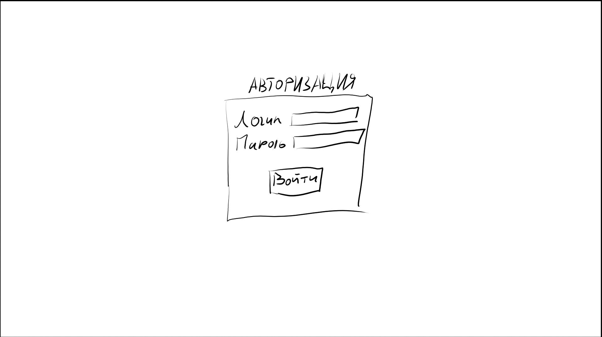
### Регистрация
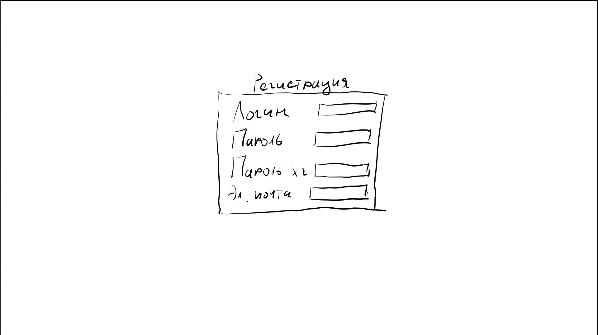
### Режим игрока
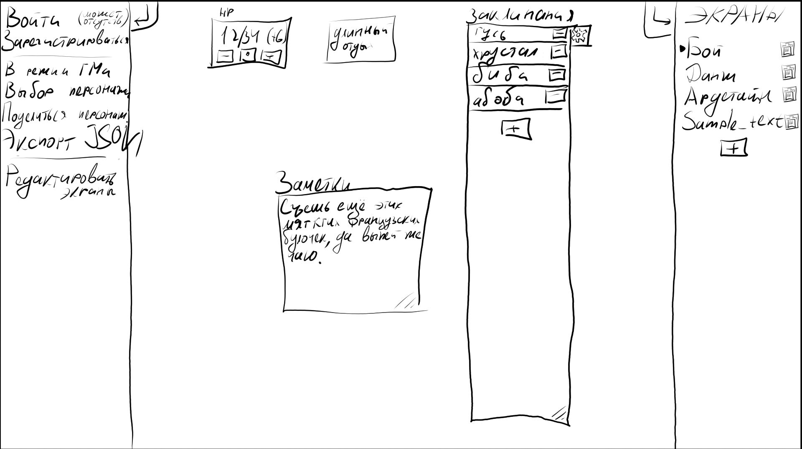
### Выбор персонажа
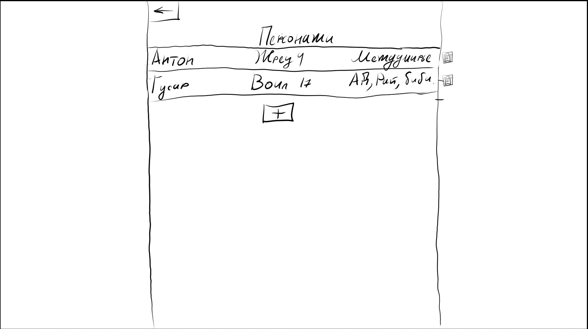
### Добавление персонажа
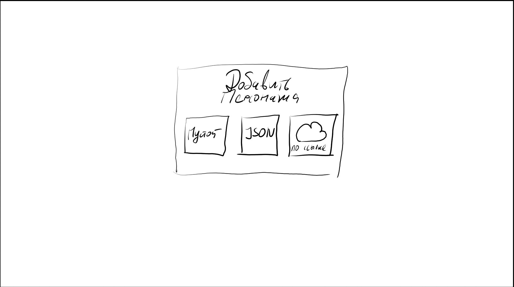
### Присоединение к кампании
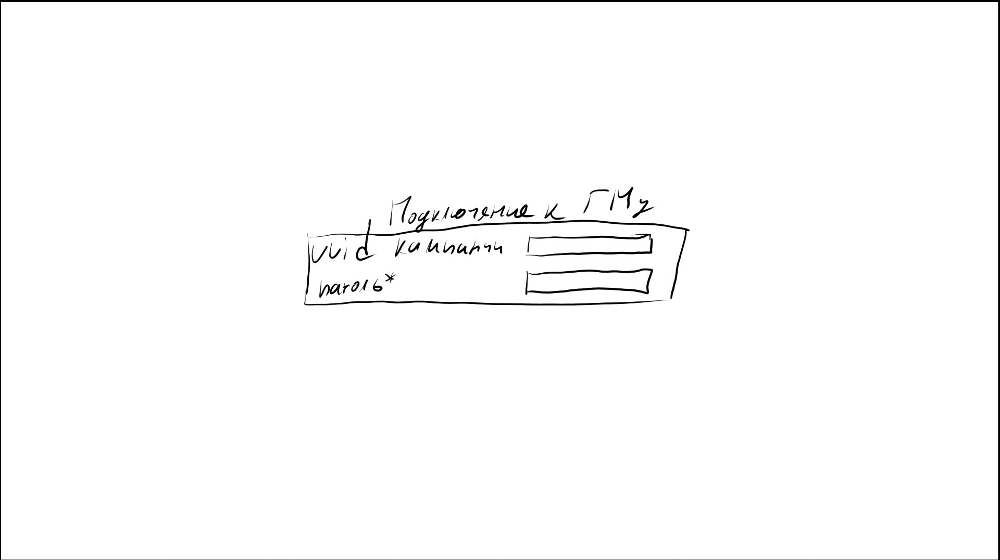
### Режим ГМа
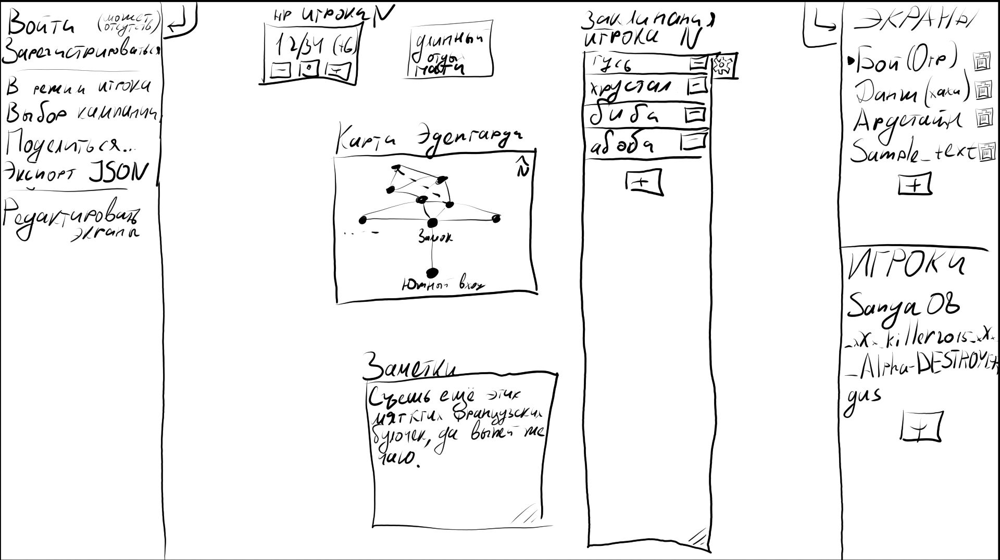
### Добавление кампании
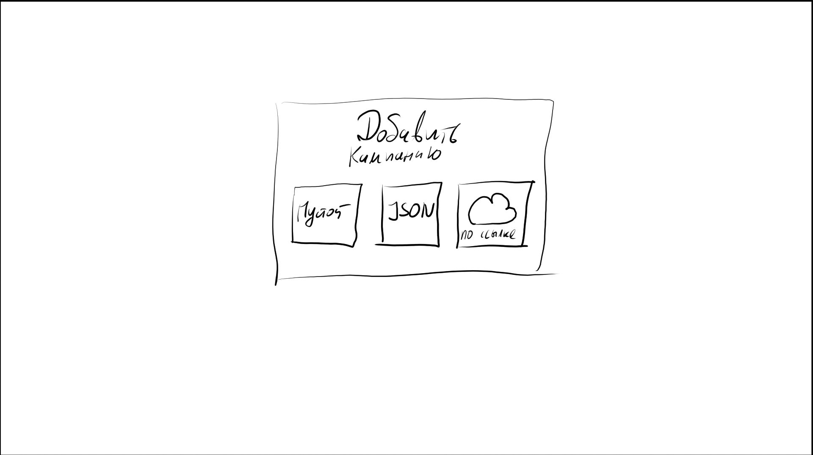